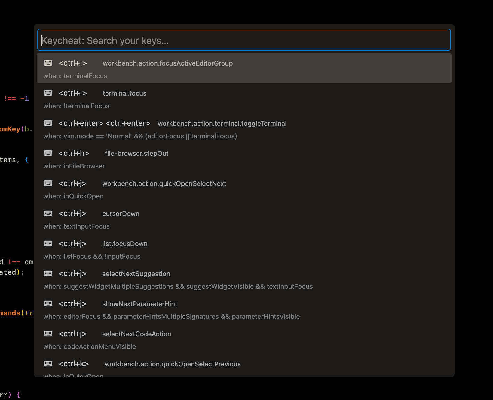

# Keycheat

## What is Keycheat?
Keycheat is your personal command cheat sheet for VS Code. Hit a shortcut, get a searchable list of *your* keybindings (including Vim bindings if you use VSCodeVim), and run them instantly. It’s like muscle memory, but searchable.

## Features

- **Super Fast Access:** Pop up your keybindings with `Ctrl+Alt+K` (or map your own!)
- **Search Everything:** Fuzzy-search all your custom keybindings (and Vim bindings if you use them)
- **Recent Commands:** Remembers what you use most and floats them to the top
- **Works with VSCodeVim:** Shows your Vim mode custom bindings too
- **Zero Setup:** Just install and go. It reads your existing keybindings and settings.
- **Cross-Platform:** Mac, Windows, Linux—no worries

## How to Use

1. **Open Keycheat**
   - Press `Ctrl+Alt+K` (or use the Command Palette: `Keycheat: Show Key Bindings`)
2. **Search**
   - Start typing to filter through your keybindings
3. **Hit Enter**
   - Run the command instantly!

## Configuration
Keycheat adds a couple of settings (totally optional):

- `keycheat.rememberRecent` (default: `true`):
  - Remembers your recently used commands and shows them first

## Pro Tips

- **Vim User?** Your custom Vim bindings show up if you’re using VSCodeVim!
- **Remap the Shortcut:** Change the default `Ctrl+Alt+K` to anything you want in your VS Code keybindings.
- **Privacy:** Keycheat only reads your local config. Nothing is sent anywhere.

## Issues & Feedback
Found a bug? Have an idea? [Open an issue](https://github.com/joshskidmore/vscode-keycheat/issues) or submit a PR!

## Changelog
See [CHANGELOG.md](./CHANGELOG.md) for what’s new.

## License
MIT

Made with love️ by [@joshskidmore](https://github.com/joshskidmore)
